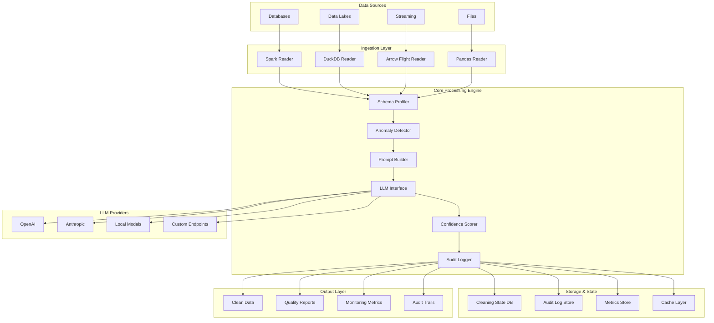
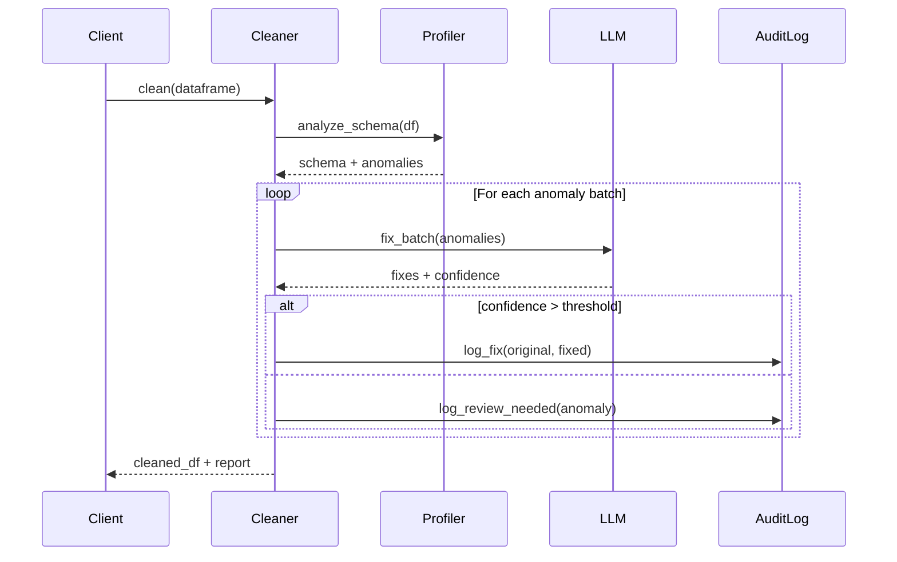
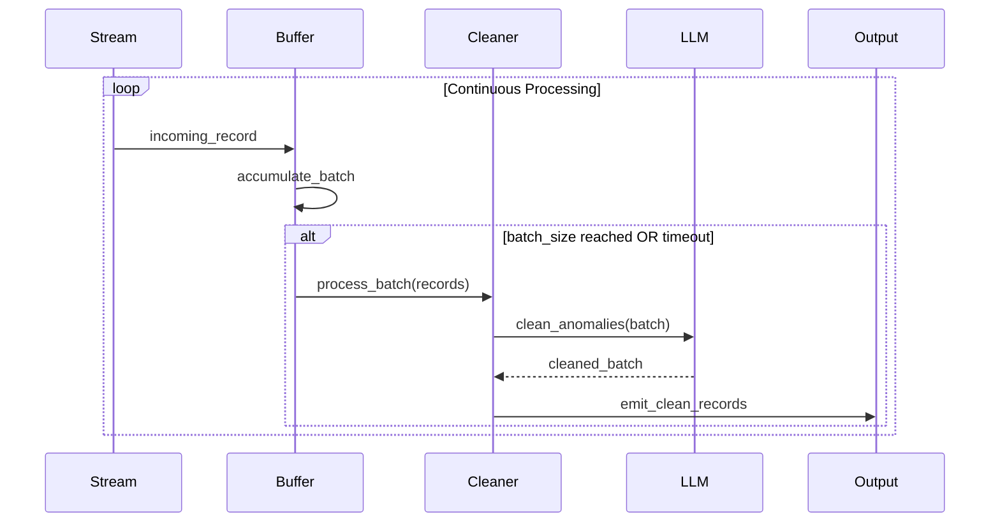

# LLM Tab Cleaner Architecture

## System Overview

**llm-tab-cleaner** is a production-grade ETL framework that operationalizes LLM-powered data cleaning research into scalable, enterprise-ready pipelines. The system transforms messy tabular data into clean, validated datasets using confidence-gated machine learning corrections.

## Architecture Principles

### Core Design Goals
1. **Production-First**: Built for enterprise ETL pipelines, not experiments
2. **Confidence-Gated**: Only apply high-confidence fixes with full audit trails
3. **Multi-Engine**: Support multiple execution backends (Spark, DuckDB, Arrow Flight)
4. **Incremental**: Process only new/changed data with state management
5. **Observable**: Comprehensive monitoring and quality metrics

### Quality Attributes
- **Scalability**: Horizontal scaling via Spark, vertical via vectorized operations
- **Reliability**: Error handling, circuit breakers, graceful degradation
- **Auditability**: Complete JSON-patch trails for regulatory compliance
- **Performance**: Sub-second cleaning for streaming, hours for batch TB+ datasets
- **Security**: No data leakage to LLM providers, on-premise deployment support

## System Architecture



## Component Architecture

### 1. Schema Profiler (`src/llm_tab_cleaner/core.py`)

**Purpose**: Statistical analysis and pattern detection for data quality assessment

**Key Functions**:
- Column type inference and validation
- Statistical profiling (distributions, cardinality, nulls)
- Pattern mining (regex patterns, format detection)
- Constraint violation detection

**Data Flow**:
```python
DataSchema = ProfilerEngine.analyze(
    dataframe=input_df,
    sample_rate=0.1,  # Sample for large datasets
    confidence_level=0.95
)
```

**Outputs**:
- Column metadata with types and constraints
- Quality scores per column
- Anomaly candidates for LLM review

### 2. Anomaly Detection Engine

**Purpose**: Identify potential data quality issues requiring LLM intervention

**Detection Methods**:
- **Statistical Outliers**: Z-score, IQR, isolation forests
- **Format Violations**: Regex pattern mismatches
- **Referential Integrity**: Orphaned foreign keys
- **Business Rules**: Domain-specific constraint violations

**Confidence Scoring**:
```python
anomaly_score = weighted_average([
    statistical_outlier_score * 0.3,
    format_violation_score * 0.4, 
    business_rule_score * 0.3
])
```

### 3. LLM Interface & Prompt Engineering

**Purpose**: Manage LLM interactions with context-aware prompts and response parsing

**Prompt Template Strategy**:
```python
prompt = f"""
TASK: Fix data quality issue in {column_name}
CONTEXT: {schema_info}, {business_rules}
EXAMPLES: {few_shot_examples}
ISSUE: {anomaly_description}
VALUE: "{problematic_value}"

Respond with JSON: {{"fixed_value": "...", "confidence": 0.95, "reasoning": "..."}}
"""
```

**Provider Management**:
- Fallback chains: Primary → Secondary → Local model
- Rate limiting and retry logic with exponential backoff
- Cost optimization: cheaper models for high-confidence cases
- Response caching with TTL for identical prompts

### 4. Confidence Calibration System

**Purpose**: Ensure confidence scores accurately reflect fix reliability

**Calibration Pipeline**:
1. **Ground Truth Collection**: Manual verification of LLM fixes
2. **Platt Scaling**: Sigmoid calibration of raw confidence scores
3. **Temporal Drift Detection**: Monitor confidence accuracy over time
4. **Model-Specific Calibration**: Different curves per LLM provider

**Implementation**:
```python
calibrated_confidence = sigmoid(
    slope * raw_confidence + intercept
)
```

### 5. Incremental Processing Engine

**Purpose**: Process only new/changed data with efficient state management

**State Management**:
- **Row-level tracking**: SHA-256 hashes for change detection
- **Schema evolution**: Handle column additions/removals gracefully
- **Checkpoint recovery**: Resume from partial failures
- **Reprocessing logic**: Re-clean when confidence improves

**Data Structures**:
```python
ProcessingState {
    last_processed_timestamp: datetime,
    row_hashes: Set[str],
    column_statistics: Dict[str, Stats],
    cleaning_rules_version: str
}
```

## Execution Backends

### Spark Integration (`src/llm_tab_cleaner/spark_cleaner.py`)

**Use Case**: Large-scale batch processing (GB-TB datasets)

**Architecture**:
- **Partition-aware processing**: LLM calls per partition
- **Driver coordination**: Aggregate statistics and rule distribution
- **Broadcast variables**: Share cleaning rules across workers
- **Checkpoint management**: Fault-tolerant processing with restart

**Performance Optimizations**:
- Columnar batch processing to reduce LLM API calls
- Smart sampling: Focus LLM effort on most anomalous data
- Resource management: Dynamic executor scaling based on workload

### DuckDB Integration

**Use Case**: Fast analytical processing on single machines

**Architecture**:
- **Vectorized operations**: Leverage DuckDB's columnar processing
- **Memory management**: Efficient handling of larger-than-RAM datasets
- **SQL integration**: Custom functions for LLM-powered cleaning
- **Parallel processing**: Multi-threaded execution within single node

### Arrow Flight Integration

**Use Case**: Real-time streaming data cleaning

**Architecture**:
- **Streaming processing**: Continuous data cleaning with low latency
- **Batching optimization**: Accumulate records for efficient LLM calls
- **Flow control**: Backpressure handling for sustainable throughput
- **State synchronization**: Consistent state across distributed flight servers

## Data Flow Patterns

### Batch Processing Flow



### Streaming Processing Flow



## Quality Assurance & Testing

### Testing Strategy

1. **Unit Tests**: Individual component validation with mocked dependencies
2. **Integration Tests**: End-to-end flows with real LLM providers
3. **Performance Tests**: Throughput and latency benchmarks
4. **Property-Based Tests**: Data quality invariants validation
5. **Chaos Engineering**: Failure scenario testing

### Quality Metrics

```python
QualityMetrics {
    accuracy: float,           # % of correct fixes
    precision: float,          # % of fixes that were actually needed
    recall: float,             # % of issues detected and fixed
    f1_score: float,           # Harmonic mean of precision/recall
    false_positive_rate: float, # % of incorrect "fixes"
    processing_speed: float,    # Records/second
    cost_per_record: float     # $ per cleaned record
}
```

## Deployment Architecture

### Production Deployment Options

#### 1. Cloud-Native (Recommended)
```yaml
Infrastructure:
  Compute: Kubernetes cluster with auto-scaling
  Storage: Object storage (S3/GCS) for data and audit logs
  Database: Managed PostgreSQL for state management
  Monitoring: Prometheus + Grafana + AlertManager
  LLM APIs: Direct integration with provider APIs
```

#### 2. On-Premise/Air-Gapped
```yaml
Infrastructure:
  Compute: Bare metal or VM cluster
  Storage: Distributed filesystem (HDFS/Ceph)
  Database: PostgreSQL cluster
  LLM: Local models (Llama, Code Llama, etc.)
  Monitoring: Self-hosted observability stack
```

#### 3. Hybrid
```yaml
Infrastructure:
  Data Processing: On-premise for data security
  LLM Calls: Cloud APIs via secure proxy
  State Storage: On-premise encrypted storage
  Monitoring: Hybrid cloud/on-premise
```

### Security Architecture

#### Data Protection
- **Encryption**: AES-256 for data at rest, TLS 1.3 for transit
- **Access Control**: RBAC with fine-grained permissions
- **Data Masking**: PII detection and automatic redaction
- **Audit Logging**: Immutable logs with cryptographic integrity

#### LLM Provider Security
- **Data Residency**: Configurable geographic restrictions
- **Zero-Retention**: Contractual guarantees for no data storage
- **On-Premise Options**: Local model deployment for sensitive data
- **Proxy Integration**: Corporate firewall and DLP compatibility

## Performance Characteristics

### Scalability Metrics

| Dataset Size | Engine | Throughput | Latency | Memory |
|-------------|--------|------------|---------|---------|
| < 1GB | Pandas | 2,500 records/sec | 50ms | 4GB |
| 1-100GB | DuckDB | 15,000 records/sec | 100ms | 8GB |
| 100GB-10TB | Spark | 45,000 records/sec | 200ms | 32GB |
| Streaming | Arrow Flight | 8,000 records/sec | 20ms | 2GB |

### Cost Optimization

#### LLM Cost Management
- **Smart Sampling**: Process representative subsets for large homogeneous datasets
- **Batch Optimization**: Group similar anomalies for bulk processing
- **Provider Selection**: Route to cheapest suitable model based on complexity
- **Caching**: Aggressive response caching for repeated patterns

#### Infrastructure Costs
- **Auto-scaling**: Scale resources based on workload patterns
- **Spot Instances**: Use preemptible compute for batch processing
- **Storage Tiering**: Move audit logs to cheaper cold storage
- **Resource Pooling**: Share infrastructure across multiple cleaning jobs

## Monitoring & Observability

### Key Metrics Dashboard

#### Business Metrics
- Data quality score trends
- Cost per cleaned record
- False positive/negative rates
- Processing throughput

#### Technical Metrics
- API latency and error rates
- Resource utilization
- Queue depths and processing delays
- Model confidence distributions

#### Security Metrics
- Authentication failures
- Data access patterns
- Anomalous API usage
- Compliance violations

### Alerting Strategy

#### Critical Alerts (Page on-call)
- Data quality score drops below 90%
- Processing pipeline failures
- Security incidents or breaches
- Cost spikes above budget thresholds

#### Warning Alerts (Slack/Email)
- Confidence scores trending downward
- API rate limiting encountered
- Resource utilization above 80%
- Unusual data patterns detected

## Future Architecture Evolution

### Roadmap Items

#### Short Term (Q1-Q2 2025)
- Multi-modal cleaning (images, documents)
- Real-time streaming support
- Advanced privacy techniques (differential privacy)
- Multi-language support

#### Medium Term (Q3-Q4 2025)
- Federated learning for cleaning rules
- AutoML for confidence calibration
- Graph-based anomaly detection
- Advanced caching and optimization

#### Long Term (2026+)
- Edge deployment for IoT data
- Quantum-resistant security
- AI-generated cleaning rules
- Self-healing data quality

### Technology Considerations

#### Emerging Technologies
- **Edge AI**: On-device cleaning for IoT and mobile
- **Federated Learning**: Privacy-preserving rule learning
- **Quantum Computing**: Advanced optimization for large-scale cleaning
- **Neuromorphic Processing**: Energy-efficient inference for edge deployment

This architecture provides a robust, scalable foundation for enterprise data cleaning while maintaining flexibility for future evolution and emerging requirements.